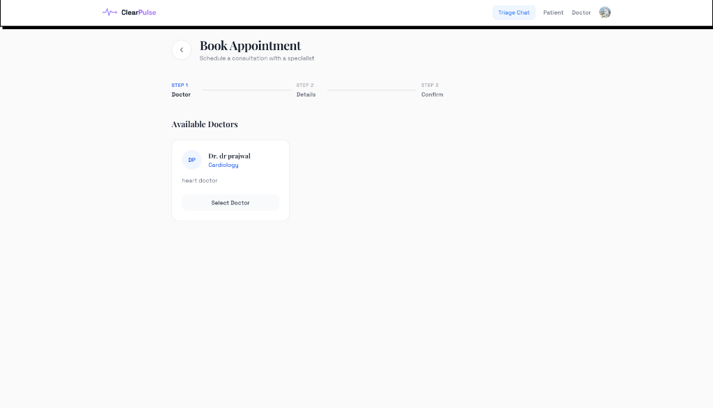
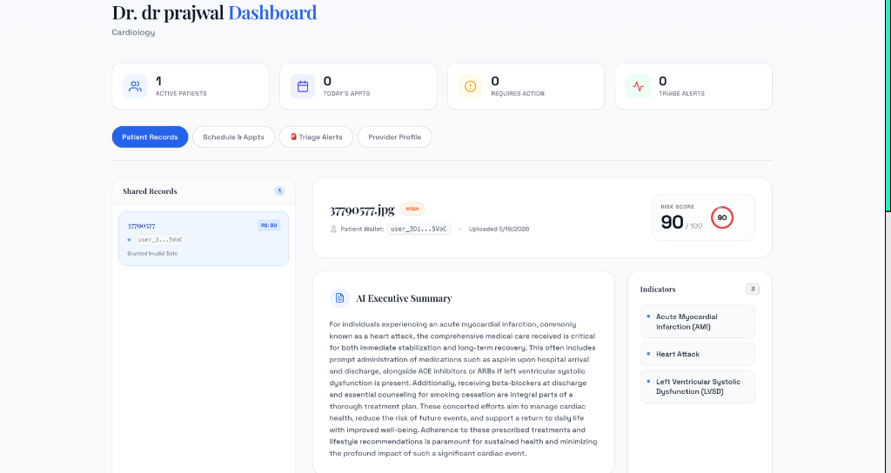
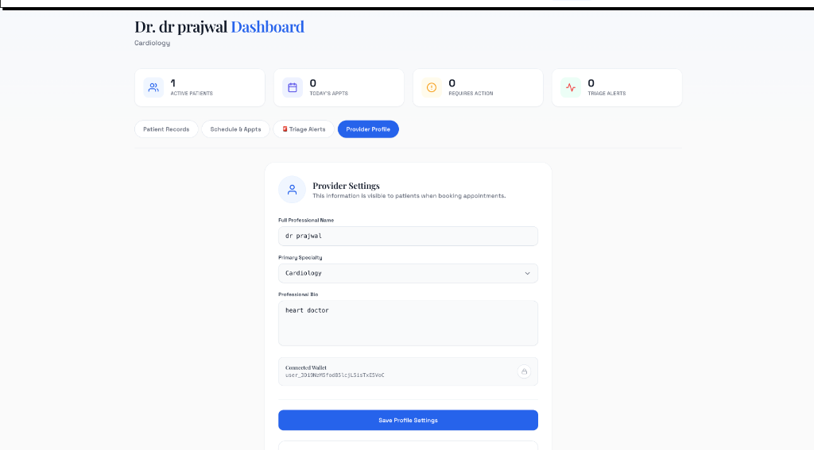
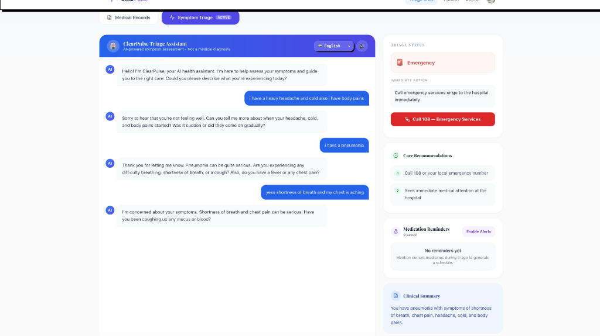

# ClearPulse AI 🏥

> **AI-powered decentralized healthcare intelligence platform.**

Upload medical reports, receive instant AI diagnostics with risk scores, chat with an AI health assistant, watch personalized AI doctor video explanations — all with patient-controlled access management and zero-knowledge encryption.

---

## 🖼️ Website Overview

### Landing Page


The landing page is the entry point of **ClearPulse AI**. Here's what each part does:

| Section | Description |
|---------|-------------|
| **Navbar** | Top bar with the ClearPulse AI logo — a custom ECG pulse-line SVG mark with `ClearPulse` in dark gray and `Pulse` in indigo — and navigation links. |
| **Hero Badge** | A small pill badge reading *"Decentralized Healthcare Intelligence"* to communicate the core value proposition at a glance. |
| **Hero Headline** | Bold `ClearPulse AI` title with the animated tagline *"Instant AI diagnostics from your reports."* — typed letter-by-letter for a dynamic feel. |
| **Hero Description** | A brief paragraph explaining the four core features: report upload, AI analysis, AI chat, and AI video — all secured via IPFS. |
| **Animated DNA Helix** | A canvas-rendered 3D animated DNA double helix runs diagonally across the right side of the hero section — two intertwining strands with purple-to-pink gradient, base-pair rungs, node dots, and a soft glow effect. Animates continuously in the background without covering content. |
| **SELECT YOUR ROLE** | Two cards that let users choose their journey: **Patient** or **Doctor**. |
| **Patient Card** | Leads to the Patient Dashboard where users can upload reports, get AI analysis, talk to AI, and control data access. |
| **Doctor Card** | Leads to the Doctor Dashboard where doctors can view patient records shared with them and review AI-generated analysis. |

---

## 🔐 Authentication — Clerk Sign In


When a user clicks **Get Started**, a Clerk-powered sign-in modal appears. Users can authenticate via Google or email.

| Element | Description |
|---------|-------------|
| **"Sign in to MediChain AI"** | Modal title with welcome subtitle |
| **Continue with Google** | One-click Google OAuth — fastest way to sign in |
| **Email address field** | Alternative email/password sign-in |
| **Continue button** | Submits credentials and proceeds to the dashboard |
| **Secured by Clerk** | Trust badge confirming authentication is handled by Clerk |


Once signed in, the user's avatar appears in the navbar. Clicking it opens the Clerk user menu:

| Element | Description |
|---------|-------------|
| **User name & email** | Displays the signed-in user's name and email |
| **Manage account** | Opens Clerk's account management panel |
| **Sign out** | Ends the session and returns to the landing page |
| **Secured by Clerk** | Confirms session management is handled by Clerk |

---

## 🧑‍⚕️ Patient Dashboard

The Patient Dashboard is the core interface for patients. It is organized into several tabs/views:

### 📊 Analysis Tab


The **Analysis** tab is the first and primary view when a patient opens their dashboard. It shows the full AI-generated report breakdown for the uploaded medical file.

#### Navigation Bar (Tab Switcher)
At the top of the dashboard, a horizontal tab bar lets patients switch between all features:

| Tab | Purpose |
|-----|---------|
| **Analysis** *(active)* | AI report summary, risk score, recommendations |
| **Health Analytics** | Trend charts and health metrics over time |
| **3D Anatomy** | Interactive 3D body viewer to explore affected regions |
| **AI Chat** | Chat with an AI health assistant |
| **Video Consult** | AI doctor avatar video explanation |
| **Data Access** | Grant/Revoke doctor access to your records |
| **Appointments** | View and manage booked appointments |

#### Report Header Card

| Element | Description |
|---------|-------------|
| **Filename** | `hearth issue.pdf` — the original uploaded report name |
| **CRITICAL PRIORITY Badge** | Red badge automatically assigned based on the AI risk score — alerts patient of urgency |
| **Date** | `2/22/2026` — date the report was uploaded and analyzed |
| **Record ID** | `077e792f...` — short hash of the record for traceability |
| **View Original Report →** | Link to open the raw uploaded PDF from IPFS storage |
| **Risk Score Gauge** | Large circular gauge showing `90 / 100 — CRITICAL` in red, giving an instant visual severity reading |

#### Executive Summary

An AI-written paragraph summarizing the full report in plain English:
> *"The patient, a 56-year-old male, is living with significant long-term health challenges including insulin-dependent diabetes and severe coronary artery disease..."*

The summary covers: detected conditions, key metrics (e.g. ejection fraction 24%), severity, and impact on the patient's daily life.

#### Health Recommendations — Action Plan

Numbered, actionable steps generated by AI:

| # | Recommendation |
|---|----------------|
| 1 | Strict adherence to all prescribed medications for heart failure, coronary artery disease, and diabetes |
| 2 | Regular monitoring of blood sugar and blood pressure with dietary adjustments |
| 3 | Engage in a physician-approved, gentle exercise program to improve cardiac health |

#### Recommended Specialist & Verification

| Element | Description |
|---------|-------------|
| **Recommended Specialist** | `Cardiologist` — AI-matched specialist based on detected conditions |
| **Find a Doctor →** | Link that routes to appointment booking pre-filtered for cardiologists |
| **Verification — HASH** | SHA-256 hash of the report stored on IPFS (`0x888dd0f...`) — proves the report hasn't been tampered with |
| **IPFS CID** | The IPFS content identifier (`0x84865335...`) of the `storeRecord()` call that pinned the report to IPFS |

### 📈 Health Analytics Tab


The **Health Analytics** tab gives patients a longitudinal view of their health trends across all uploaded reports.

#### Risk Trends Chart

| Element | Description |
|---------|-------------|
| **Analysis History** | Shows total reports scanned (e.g. `3 REPORTS SCANNED`) with aggregated risk metrics |
| **Average Risk** | Displays the mean risk score across all uploaded reports (e.g. `85`) |
| **Trend** | Shows the latest risk score trend value (e.g. `110`) in red, indicating an upward/worsening trend |
| **Line Chart** | A time-series graph plotting risk scores over dates — helps patients visualize whether their health is improving or deteriorating over time |

#### Health Timeline

A chronological, card-based list of all past reports — most recent first. Each card shows:

| Element | Description |
|---------|-------------|
| **Report Name** | Original uploaded filename (e.g. `LABREPORT3.PDF`, `LABREPORT.PDF`) |
| **Date & Time** | Exact timestamp of the upload (e.g. `Feb 22, 2026 @ 06:16 AM`) |
| **Priority Badge** | Color-coded urgency label — `HIGH` (orange) or `CRITICAL` (red) based on AI risk score |
| **Risk Score Circle** | Circular gauge showing the score (e.g. `90 CRITICAL`, `85`) for quick severity reading |
| **AI Summary** | Plain-English paragraph summarizing detected conditions — e.g. cardiac history with LVEF 24%, insulin-dependent diabetes, triple vessel coronary artery disease |
| **Condition Tags** | Pill-shaped tags for each detected condition (e.g. `INSULIN-DEPENDENT DIABETES MELLITUS (IDDM)`, `TRIPLE VESSEL CORONARY ARTERY DISEASE (TVCAD)`, `LEFT VENTRICULAR DYSFUNCTION`, `MYOCARDIAL ISCHEMIA`) |

> This view allows patients and doctors to track health progression over multiple reports — crucial for chronic condition management.

### 🤖 AI Chat Tab

The **AI Chat** tab provides an intelligent, context-aware health assistant directly inside the dashboard. Responses are grounded in the patient's uploaded medical records.

| Element | Description |
|---------|-------------|
| **ClearPulse AI Header** | Shows the bot name, a pulsing green **Online & Ready to Help** status dot, and a gradient robot avatar icon |
| **Greeting Message** | On open, the AI proactively introduces itself and acknowledges having reviewed the patient's records, ready to explain findings or answer questions |
| **⚠️ Medical Disclaimer Box** | A rose-colored warning block beneath every AI response — reminds users the AI cannot diagnose and advises immediate emergency care for severe symptoms |
| **HIGH CONFIDENCE · 100%** | A confidence score label shown under each AI response to indicate how certain the model is about its answer |
| **Formatted Markdown Output** | AI responses render with **bold text**, numbered lists, bullet points, and section headings — not raw symbols |
| **User Message Bubble** | Patient messages appear as right-aligned gradient blue bubbles |
| **One-Click Appointment Booking** | Typing *"book appointment"* triggers the chatbot to auto-match the patient to the best-fit doctor (e.g. Cardiologist) and present an inline booking widget with date/time pickers |
| **Input Bar** | Full-width pill input at the bottom with a blue send button; supports Enter key to submit |

### 🎥 AI Doctor Video Consult Tab

The **Video Consult** tab connects patients to a real-time AI doctor avatar powered by **Tavus** — a photorealistic AI video technology that generates a live-speaking doctor personalised to the patient's diagnosis.

#### Step 1 — Pre-Join Device Check


Before the session begins, patients go through a device setup screen:

| Element | Description |
|---------|-------------|
| **"Are you ready to join?" Header** | Confirms the patient is about to enter a live AI video consultation |
| **Join Button** | Teal button that initiates the Tavus session and connects to the AI avatar |
| **Camera Preview** | Live webcam feed of the patient shown before joining — confirms camera is working |
| **SHREE label** | Patient's name overlaid on the preview tile |
| **Controls bar** | **Turn off / Mute / Effects / Reduce / More** — standard controls available before joining |
| **Camera Dropdown** | Device selector — e.g. `HP TrueVision HD Camera` |
| **Microphone Dropdown** | Input device selector with a **Test your mic** link |
| **Speakers Dropdown** | Output device selector with a **Play test sound** link |

#### Step 2 — Live AI Doctor Avatar Session


Once joined, the patient enters a fullscreen live video call with the AI-generated doctor avatar:

| Element | Description |
|---------|-------------|
| **🔴 LIVE · 00:00** | Top-left live session indicator with a real-time duration counter |
| **2 people in call** | Confirms both the patient and the AI avatar are connected |
| **AI Doctor Avatar (main feed)** | A photorealistic Tavus-generated doctor speaking live — explaining the patient's diagnosis, conditions, and recommendations. Scripted dynamically from the AI analysis of the uploaded report |
| **AI Specialist label** | Bottom-left name card — `AI Specialist` · `Cardiologist (Nuclear Cardiology)` — specialist role auto-assigned from the AI report recommendation |
| **SHREE (You) — Pip** | Top-right picture-in-picture of the patient's own webcam feed |
| **Layout toggle** | Bottom-right grid icon to switch between speaker and gallery view |
| **End Call (✕)** | Red button to terminate the session |

> Every consultation is uniquely personalised — the Tavus avatar is scripted in real time using the patient's AI-generated summary, risk score, detected conditions, and recommended specialist.


### 🦴 3D Anatomy Tab — Neural Body Scanner


The **3D Anatomy** tab renders an interactive full-body anatomical viewer powered by the AI analysis of the patient's report. It uses a sci-fi "Neural Body Scanner" interface to make health data visually intuitive.

#### Overview View

| Element | Description |
|---------|-------------|
| **NEURAL BODY SCANNER** badge | Top-left branding label for the 3D viewer mode |
| **Alert counter** (top-right) | Red badge showing `⚠ 3 CRITICAL` — the total count of organs flagged as critical by AI |
| **3D Skeleton + Organs** | A full-body anatomical model with highlighted organs — critical organs glow in **orange/red** based on risk severity. Blood vessels, gut, and heart are visibly highlighted in this view |
| **PEEL: BLOOD VESSELS** button | Bottom-left layer toggle — peel away the skin/muscle layer to reveal internal vasculature and organ placement |
| **RESTORE LAYERS** | Resets the model back to its default layered view |

#### System Overview Panel (Right Sidebar)

Live per-organ risk assessment derived from AI report analysis:

| Organ | Risk % | Status |
|-------|--------|--------|
| **Brain** | 19% 🟢 | No anomalies detected |
| **Lungs** | 77% 🔴 | Critical: breath detected |
| **Heart** | 88% 🔴 | Critical: heart, cardio detected |
| **Liver** | 5% 🟢 | No anomalies detected |
| **Gut** | 96% 🔴 | Critical: diabetes, sugar detected |
| **Kidneys** | 8% 🟢 | No anomalies detected |

> The sidebar updates live based on the AI analysis of the uploaded report. Critical organs are highlighted in red both in the sidebar and on the 3D model.

---

#### Organ Detail View (Click-to-Inspect)


Clicking any organ on the 3D model (or in the sidebar) opens a detailed right-side panel. The exploded view also separates individual organs on the left for anatomical clarity.

**Example — Heart selected (`CRITICAL RISK · 95%`):**

| Section | Content |
|---------|---------|
| **CRITICAL RISK badge** | Red badge with `95%` risk — immediately communicates severity |
| **Clinical Description** | *"The patient exhibits severe heart dysfunction characterized by a profoundly low Left Ventricular Ejection Fraction of 24%, triple vessel coronary artery disease, a dilated and ischemic left ventricle with 10% ischemic burden, and global hypokinesia."* |
| **AI ANALYSIS bullets** | Step-by-step AI findings for this specific organ: TVCAD diagnosis, LVEF of 24%, dilated left ventricle, ischemic burden of 10%, breathlessness consistent with cardiac output reduction, Summed Difference Score of 8 |
| **BIOMARKERS panel** | Key cardiac biomarkers extracted from the report: `Resting LVEF: 24%`, `Total LV Ischemic Burden: 10%`, `Summed Difference Score: 8`, `BNP/NT-proBNP: Not provided`, `Cardiac Troponins: Not provided`, `Lipid Panel: Not provided`, `HbA1c` |

> The exploded organ view (left side) shows isolated Brain, Lungs, Kidneys, Liver, and Gut — allowing the patient to visually understand which organs are affected without medical training.

### 🔐 Data Access Tab — Access Control


The **Data Access** tab gives patients full, sovereign control over who can view their medical records. Records are stored on IPFS and access is managed server-side — no doctor can view records without the patient's explicit grant.

| Element | Description |
|---------|-------------|
| **MANAGE ACCESS header** | Orange lock icon with the title *"MANAGE ACCESS — Control who views this medical record"* — clearly communicates the purpose of the tab |
| **SELECT A DOCTOR… Dropdown** | Dropdown listing all registered doctors on the platform — patient picks who to grant access to |
| **SELECT A DOCTOR FIRST button** | Disabled action button that activates once a doctor is selected — triggers the access grant |
| **✅ ACCESS GRANTED TO M V DEEPAK** | Bright green confirmation banner — appears immediately after a successful grant confirming the doctor now has access |
| **GRANTED DOCTORS panel** | Lists all doctors who currently have active access to this record |
| **Doctor entry — M V Deepak** | Shows the doctor's name and identifier for verification |
| **REVOKE button** | Red button next to each granted doctor — instantly removes that doctor's access |

> Records are pinned to IPFS and access is cryptographically scoped — only doctors explicitly granted access by the patient can retrieve the content.

### 📅 Book Appointment — 3-Step Booking Flow

Patients can book specialist appointments directly from the platform via a clean 3-step wizard at `/patient/book`.

---

#### Step 1 — Select a Doctor



A full-page grid of all registered specialist doctors, filterable by specialty:

| Element | Description |
|---------|-------------|
| **"Book Appointment" header** | Title with subtitle *"Schedule a consultation with a specialist"* and a back arrow to return to the dashboard |
| **Progress stepper** | Top bar showing `STEP 1: Doctor → STEP 2: Details → STEP 3: Confirm` — current step highlighted in blue |
| **"Available Doctors" grid** | Responsive 3-column card grid listing all doctors registered on the platform |
| **Doctor card** | Each card shows the doctor's **avatar initials**, **full name**, **specialty** (linked in blue), a short **bio excerpt**, and a **Select Doctor** button |
| **Selected state** | The chosen card gets a blue border highlight (e.g. `Dr. Emily Rodriguez — Dermatology` shown selected) |

**Doctors visible in this view:**
| Doctor | Specialty | Bio |
|--------|-----------|-----|
| Dr. Aisha Mahmound | Endocrinology | Diabetes management, thyroid… |
| Dr. Emily Rodriguez | Dermatology | Skin cancer screening, eczema… |
| Dr. James Patel | Neurology | Headache disorders, stroke… |
| Dr. Manogna | Neurology | Dedicated neurologist |
| Dr. Michael Kim | Orthopedics | Sports injuries, joint replacement… |
| Dr. Sarah Chen | Cardiology | Board-certified cardiologist, 12 years experience |

---

#### Step 2 — Choose Date, Time & Notes


After selecting a doctor, the patient picks a date and time slot:

| Element | Description |
|---------|-------------|
| **Selected Doctor panel** | Top card confirms the chosen doctor (e.g. `Dr. shreeharsha`) with a **Change** button to go back |
| **Select Date strip** | Horizontally scrollable date picker starting from today — selected date highlighted in solid blue (e.g. `Tomorrow · 23 FEB`) |
| **Custom Date button** | Calendar icon button to pick a date beyond the visible strip |
| **Available Times grid** | Grid of time slots for the chosen date (e.g. `09:00`, `09:30`, `10:00`…`16:30`); selected slot shown in blue (e.g. `10:00`) |
| **Additional Notes field** | Optional free-text box for the patient to describe symptoms (e.g. *"I have headache"*) |
| **Confirm Appointment button** | Full-width blue CTA that submits the booking and advances to Step 3 |

---

#### Step 3 — Confirmation


Once confirmed, the wizard shows a success screen:

| Element | Description |
|---------|-------------|
| **Progress stepper** | All 3 steps now fully highlighted — `Doctor → Details → Confirm` all in blue, indicating completion |
| **✅ Green checkmark** | Large animated green circle with a checkmark — immediate visual confirmation |
| **"Appointment Requested" heading** | Bold success title |
| **Confirmation message** | *"Your appointment with Dr. shreeharsha has been successfully requested. You will receive a confirmation shortly."* |
| **Return to Dashboard** | Outlined button to go back to the patient dashboard |
| **Book Another** | Blue button to immediately start a new appointment booking |

---

## 👨‍⚕️ Doctor Dashboard



The Doctor Dashboard gives verified doctors a clean, clinical view of all patient records explicitly shared with them.

### Header

| Element | Description |
|---------|-------------|
| **"Dr. shreeharsha Dashboard"** | Personalized heading with the doctor's name — *"Manage your patients, appointments, and medical records"* |
| **Complete Profile button** | Top-right CTA to fill in specialty, bio, and contact details shown to patients during booking |

### Stats Bar

Four at-a-glance metric cards across the top:

| Metric | Value shown | Description |
|--------|-------------|-------------|
| **Active Patients** | `1` | Patients who have granted this doctor record access |
| **Today's Appts** | `1` | Appointments scheduled for today |
| **Requires Action** | `3` ⚠️ | Records or items flagging attention (shown in amber) |
| **Clinical Notes** | `0` | Doctor-authored notes on patient records |

### Tab Navigation

| Tab | Description |
|-----|-------------|
| **Patient Records** *(active)* | View all shared patient records and their AI analysis |
| **Schedule & Appts** | Manage appointment schedule and view bookings |
| **Provider Profile** | Edit the doctor's public profile visible to patients |

### Shared Records Sidebar (Left)

| Element | Description |
|---------|-------------|
| **"Shared Records" panel** | Lists every record the patient has granted access to, with a blue count badge (`1`) |
| **Record entry — `lab 2`** | Shows the filename, risk score badge `RS: 10`, the patient's identifier, and grant date (`Granted 2/21/2026`) |
| **Selected state** | The active record is highlighted with a blue background in the sidebar |

### AI Analysis Panel (Right)

Clicking a record loads the full AI analysis on the right:

| Element | Description |
|---------|-------------|
| **Report header** | Filename `lab 2.pdf` with a `LOW` green urgency badge, patient identifier, and upload timestamp (`Uploaded 2/21/2026`) |
| **Risk Score gauge** | Circular gauge showing `10 / 100` — green, indicating low risk |
| **AI Executive Summary** | Full AI-generated paragraph in plain English: *"The patient's recent whole abdomen ultrasound provided reassuring results, indicating all examined organs — liver, gall bladder, pancreas, spleen, aorta — appear healthy and within normal limits…"* |
| **Indicators panel** | Right-side card showing extracted clinical indicators — `No conditions isolated` for this low-risk report |
| **Specialist Ref** | `General Practitioner` — AI-recommended referral based on the report |
| **Conditions** | `0` — no flagged conditions for this report |


### Schedule & Appts Tab — Doctor Appointment Management


The **Schedule & Appts** tab gives doctors a full view of incoming booking requests and their confirmed schedule. This is where doctors approve or decline patient-booked appointments.

#### Pending Approval Requests

Cards shown for every appointment awaiting doctor confirmation, with a `NEEDS REVIEW` amber badge:

| Element | Description |
|---------|-------------|
| **`NEEDS REVIEW` badge** | Amber pill label — indicates the doctor has not yet responded to this booking request |
| **Date & Time** | Appointment date and requested time (e.g. `Sun, Feb 22, 2026 · 09:00:00`) |
| **Patient identifier** | Patient's ID shown for reference |
| **Reason** | Optional note from the patient — e.g. *"I have headache"* (shown on the third pending card) |
| **Confirm Booking** | Blue CTA — marks the appointment as confirmed and notifies the patient |
| **Decline** | Outlined button — rejects the appointment request |

**Pending requests visible:**
| # | Date | Time | Status |
|---|------|------|--------|
| 1 | Sun, Feb 22, 2026 | 09:00 | NEEDS REVIEW |
| 2 | Mon, Feb 23, 2026 | 12:00 | NEEDS REVIEW |
| 3 | Mon, Feb 23, 2026 | 10:00 | NEEDS REVIEW (Reason: *"I have headache"*) |

#### Scheduled Schedule

A chronological timeline of all appointments (confirmed + pending) — `3 total` shown:

| Element | Description |
|---------|-------------|
| **Time circle avatar** | Circular badge showing the appointment hour (e.g. `09 HH`, `12 HH`, `10 HH`) for quick scanning |
| **Date & Time** | Full datetime of each appointment (e.g. `Sun, Feb 22, 2026 • 09:00:00`) |
| **Patient identifier** | Truncated patient ID |
| **Reason snippet** | Patient's note shown inline where provided (e.g. `I have headache`) |
| **`PENDING` badge** | Amber status badge — all 3 appointments still pending doctor confirmation |

#### Medical Disclaimer Footer

> ⚠️ *"ClearPulse AI provides AI-powered analysis for informational purposes only. It is not a substitute for professional medical advice, diagnosis, or treatment. Always consult a qualified healthcare provider for medical decisions."*

### Provider Profile Tab



The **Provider Profile** tab lets doctors set up their public-facing profile — information that patients see when browsing or booking appointments.

| Element | Description |
|---------|-------------|
| **Provider Settings header** | Doctor avatar icon with the title *"Provider Settings"* and subtitle *"This information is visible to patients when booking appointments."* |
| **Full Professional Name** | Text input pre-filled with the doctor's name (e.g. `shreeharsha`) |
| **Primary Specialty** | Dropdown selector for specialty (e.g. `General Practice`) — the chosen specialty is what appears on the doctor's card in the patient booking grid |
| **Professional Bio** | Free-text area for a short professional description (e.g. `medicine`) — shown as the bio excerpt on doctor cards |
| **Save Profile Settings** | Full-width blue button that persists all changes to the database |

> Profile data is stored securely — patients see the doctor's name, specialty, and bio when browsing or booking appointments.

---

## 🎨 Recent UI Updates

### Animated DNA Helix Background

A fully custom canvas-based animated DNA helix was added to the hero section of the landing page. It replaces the static background image with a living, breathing visual that reinforces the medical/genomics theme.

**Technical details:**
- Built with the HTML5 Canvas API and `requestAnimationFrame` — zero external dependencies
- Two sigmoid strands rendered as smooth line segments with per-segment depth (`z = sin(angle)`) driving stroke width and opacity for a true 3D cylindrical look
- Helix spine runs **diagonally** from top-right to bottom-left (matching the MYDNA reference aesthetic), positioned at ~55–82% canvas width so it stays right-side without overlapping text
- Color gradient: violet (`hsl(265)`) at the top → pink-purple (`hsl(320)`) at the bottom
- Base-pair rungs drawn every 4 steps with semi-transparent strokes; node dots at attachment points
- Soft glow pass: a blurred wide stroke rendered first to create luminous halo around strands
- Floating particle dust cloud (80 deterministic particles) scattered around the helix spine
- Fully responsive — canvas resizes with the window via a `resize` event listener
- Cleans up `requestAnimationFrame` and event listeners on component unmount

**File:** `frontend/src/components/landing/DNABackground.tsx`

---

### Logo Redesign

The navbar logo was redesigned from a generic blue rounded-square icon to a custom **ECG pulse-line SVG mark**.

| Before | After |
|--------|-------|
| Blue rounded square with stacked-layers icon | Custom SVG: flat baseline → sharp ECG spike → flat tail → filled dot with halo |
| `gradient-text` rainbow wordmark | `Clear` in dark gray + `Pulse` in solid indigo |

**Design rationale:** The pulse/heartbeat waveform is instantly recognisable as medical without being cliché. Single-color (`indigo-500`) keeps it crisp at small sizes. The wordmark split (`Clear` / `Pulse`) adds visual hierarchy without gradients.

**File:** `frontend/src/components/Navbar.tsx`

---

## 🏗️ Architecture
| Layer | Tech |
|-------|------|
| **Frontend** | Next.js 15, TypeScript, TailwindCSS |
| **Backend** | FastAPI (Python), PostgreSQL |
| **Storage** | IPFS (decentralized file storage) |
| **AI Services** | Gemini, Groq, Tavus Avatar API, Sarvam |
| **Auth** | Clerk |

### System Flow

```
Patient ──► Upload Report ──► IPFS Storage (pinned)
                                    │
                          FastAPI Backend (Python)
                          AI extracts text + analysis
                                    │
                    SHA-256 hash ──► IPFS record (tamper-proof)
                                    │
                Patient views analysis, chats with AI,
                watches AI doctor video, manages access
                                    │
                Doctor (granted access) ──► Views records
```

---

## 🚀 Quick Start

### 1. Frontend

```bash
cd frontend
npm install
npm run dev        # → http://localhost:3000
```

### 2. Backend

```bash
cd backend
python -m venv .venv
source .venv/bin/activate
pip install -r requirements.txt
uvicorn main:app --reload --port 8000
```

### 3. Environment Variables

**`frontend/.env`**:
```
NEXT_PUBLIC_CLERK_PUBLISHABLE_KEY=<your-clerk-key>
NEXT_PUBLIC_BACKEND_URL=http://localhost:8000
```

**`backend/.env`**:
```
GEMINI_API_KEY=<your-gemini-key>
GROQ_API_KEY=<your-groq-key>
TAVUS_API_KEY=<your-tavus-api-key>
TAVUS_REPLICA_ID=<your-tavus-replica-id>
IPFS_API_KEY=<your-ipfs-key>
```

---

## 📁 Project Structure

```
ClearPulse/
├── backend/                        # FastAPI Python backend
│   ├── main.py                     # App entry point
│   ├── requirements.txt
│   ├── routes/
│   │   ├── analyze.py              # AI report analysis
│   │   ├── chatbot.py              # AI chat
│   │   ├── appointments.py         # Appointment management
│   │   ├── doctor.py               # Doctor routes
│   │   ├── records.py              # Medical records
│   │   ├── ipfs.py                 # IPFS storage
│   │   ├── triage.py               # Triage AI
│   │   └── tavus.py                # AI video
│   └── services/
│       ├── gemini.py               # Gemini AI service
│       ├── groq_client.py          # Groq AI service
│       ├── sarvam.py               # Sarvam service
│       ├── tavus.py                # Tavus video service
│       └── vault.py                # Secure storage
├── frontend/                       # Next.js App Router
│   └── src/
│       └── app/
│           ├── page.tsx            # Landing page (role selector)
│           ├── patient/
│           │   ├── page.tsx        # Patient dashboard (all tabs)
│           │   ├── book/page.tsx   # Appointment booking
│           │   └── components/
│           │       ├── AnalysisView.tsx
│           │       ├── AppointmentsView.tsx
│           │       └── AccessManager.tsx
│           └── doctor/
│               └── page.tsx        # Doctor dashboard
└── screenshots/                    # Website screenshots (for README)
```

---

## 🗄️ Backend Services

- **AI Analysis**: Gemini & Groq power report analysis, triage, and chatbot responses
- **IPFS Storage**: Medical reports are pinned to IPFS via the `/api/ipfs` route — content-addressed, tamper-proof, and decentralized
- **Tavus**: AI doctor avatar video generation personalised to each patient's diagnosis
- **Sarvam**: Multilingual support for regional language interactions
- **Vault**: Secure key management for encrypted record access


---

## Privacy & Security

- **Zero-Knowledge Encryption**: Keys locally managed, never stored server-side.
- **Local PDF Processing**: In-browser text extraction via pdfjs-dist.
- **IPFS Storage**: Reports content-addressed and decentralized.
- **Access Control**: No doctor can access records without explicit patient grant.
- **Cryptographic Verification**: SHA-256 hashes ensure tamper-proof integrity.

---

## Triage Chatbot - AI Emergency Triage & Care Recommendation Assistant



The Triage Chatbot conducts a structured medical intake and generates a personalized care plan.

### Structured Intake Protocol

| Step | Information Collected |
|------|-----------------------|
| 1 | Chief Complaint |
| 2 | Onset - sudden or gradual |
| 3 | Severity - rated 1-10 |
| 4 | Location & Radiation |
| 5 | Associated Symptoms |
| 6 | Medical History |
| 7 | Current Medications |
| 8 | Risk Factors |

### Triage Levels

| Level | Description |
|-------|-------------|
| Home | Mild - OTC meds, rest, hydration |
| Clinic | Professional evaluation within 1-3 days |
| Emergency | Life-threatening - chest pain, stroke, anaphylaxis |
| Assessing | Still collecting information |

### Medicine Suggestions & Care Recommendation Engine

The AI generates tailored care_recommendations based on triage level:

**Home Care - OTC Medicine Suggestions:**
- Specific OTC medicines (paracetamol for fever, antacids for acidity, ORS for dehydration, antihistamines for allergies)
- Home remedies (warm compress, steam inhalation, ginger tea, saltwater gargle)
- Red-flag symptoms to watch for
- Rest, hydration, and dietary advice

**Clinic Care:**
- Exact specialist to visit (cardiologist, endocrinologist, neurologist)
- Diagnostic tests likely needed (CBC, ECG, fasting blood sugar, urine culture)
- Structured symptom summary to share with the doctor

**Emergency Care:**
- Immediate instructions: Call 108, do not eat/drink, keep patient lying flat
- Step-by-step first-aid while waiting for services
- All non-urgent suggestions suppressed

### AI Engine

| Feature | Detail |
|---------|--------|
| Primary | Gemini 2.5 Flash, JSON output, temp 0.2 |
| Fallback | Groq LLaMA 3.3 70B - auto-failover |
| Memory | Full history every turn |
| Persistence | Sessions saved to DB, visible to doctors |

### Triage API Endpoints

| Method | Endpoint | Description |
|--------|----------|-------------|
| POST | /api/triage/chat | Message -> structured triage + care plan |
| POST | /api/triage/stt | Voice -> transcript (Sarvam STT) |
| POST | /api/triage/tts | Text -> speech audio (Sarvam TTS) |
| GET | /api/triage/sessions/{patient_id} | Past triage sessions |
| GET | /api/triage/doctor-alerts/{doctor_id} | Clinic/Emergency alerts |
| GET | /api/triage/languages | Supported languages |

---

## Speech-to-Text (STT) & Text-to-Speech (TTS) via Sarvam API

### STT - POST /api/triage/stt
- Formats: WAV (PCM 16-bit), MP3, OGG
- Languages: en-IN, hi-IN, ta-IN, te-IN, bn-IN
- Returns: transcribed text + language code
- Errors: 503 if SARVAM_API_KEY missing, 500 on failure

### TTS - POST /api/triage/tts
- Request: JSON with text and language_code (e.g. hi-IN)
- Response: audio/wav stream
- Features: regional voices, medicine instructions spoken aloud, hands-free for non-readers
- Errors: 503 if SARVAM_API_KEY missing, 500 on failure

Voice-driven triage: patients speak symptoms, AI responds with spoken medicine suggestions in their preferred language.

---

> **Built with ClearPulse** - Decentralized. Intelligent. Patient-first.
